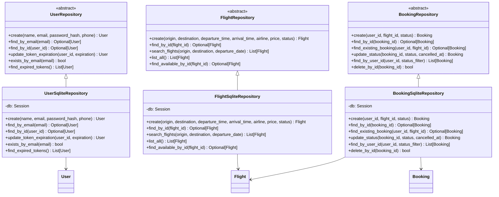
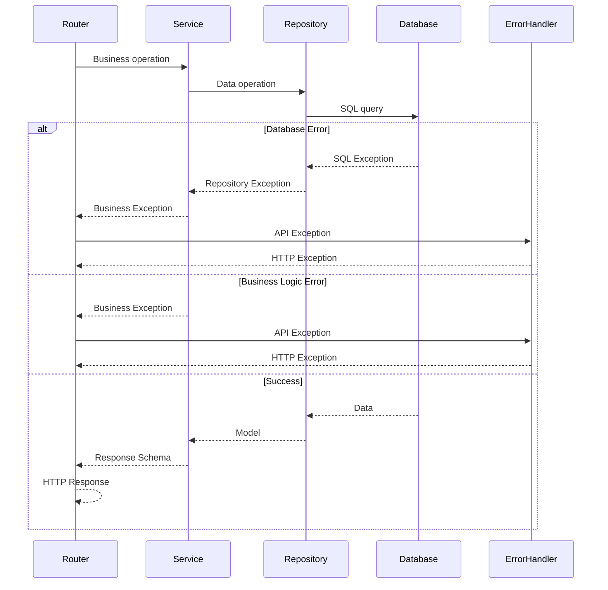

# API Architecture Diagrams

This document provides detailed architectural diagrams specific to the FastAPI backend implementation, focusing on the repository pattern and service layer architecture.

## API Layer Architecture

```mermaid
graph TB
    subgraph "HTTP Layer"
        Client[HTTP Client]
        Middleware[FastAPI Middleware]
    end
    
    subgraph "Router Layer"
        UserRouter[users.py]
        FlightRouter[flights.py]
        BookingRouter[bookings.py]
        ChatRouter[chat.py]
        HealthRouter[health_check.py]
    end
    
    subgraph "Service Layer"
        UserService[UserBusinessService]
        FlightService[FlightBusinessService]
        BookingService[BookingBusinessService]
        ChatService[AgentChatService]
        HealthService[SystemHealthService]
    end
    
    subgraph "Repository Abstractions"
        UserRepoABC[UserRepository ABC]
        FlightRepoABC[FlightRepository ABC]
        BookingRepoABC[BookingRepository ABC]
        ChatRepoABC[ChatbotMessageRepository ABC]
    end
    
    subgraph "Repository Implementations"
        UserRepo[UserSqliteRepository]
        FlightRepo[FlightSqliteRepository]
        BookingRepo[BookingSqliteRepository]
        ChatRepo[ChatbotMessageSqliteRepository]
    end
    
    subgraph "Data Models"
        UserModel[User Model]
        FlightModel[Flight Model]
        BookingModel[Booking Model]
        ChatModel[ChatbotMessage Model]
    end
    
    subgraph "Database"
        SQLite[(SQLite Database)]
    end
    
    Client --> Middleware
    Middleware --> UserRouter
    Middleware --> FlightRouter
    Middleware --> BookingRouter
    Middleware --> ChatRouter
    Middleware --> HealthRouter
    
    UserRouter --> UserService
    FlightRouter --> FlightService
    BookingRouter --> BookingService
    ChatRouter --> ChatService
    HealthRouter --> HealthService
    
    UserService --> UserRepoABC
    FlightService --> FlightRepoABC
    BookingService --> BookingRepoABC
    BookingService --> FlightRepoABC
    ChatService --> ChatRepoABC
    
    UserRepoABC -.->|implements| UserRepo
    FlightRepoABC -.->|implements| FlightRepo
    BookingRepoABC -.->|implements| BookingRepo
    ChatRepoABC -.->|implements| ChatRepo
    
    UserRepo --> UserModel
    FlightRepo --> FlightModel
    BookingRepo --> BookingModel
    ChatRepo --> ChatModel
    
    UserModel --> SQLite
    FlightModel --> SQLite
    BookingModel --> SQLite
    ChatModel --> SQLite
    
    style "HTTP Layer" fill:#e1f5fe
    style "Router Layer" fill:#e8f5e8
    style "Service Layer" fill:#e3f2fd
    style "Repository Abstractions" fill:#fff3e0
    style "Repository Implementations" fill:#f1f8e9
    style "Data Models" fill:#fce4ec
    style "Database" fill:#f3e5f5
```

## Repository Pattern Deep Dive



## Service Layer Dependencies

```mermaid
graph TB
    subgraph "Dependency Injection"
        CreateUserRepo[create_user_repository]
        CreateFlightRepo[create_flight_repository]
        CreateBookingRepo[create_booking_repository]
        CreateChatRepo[create_chatbot_message_repository]
        CreateUserService[create_user_service]
        CreateFlightService[create_flight_service]
        CreateBookingService[create_booking_service]
        CreateChatService[create_chat_service]
    end
    
    subgraph "Database Session"
        DBSession[get_database_session]
    end
    
    subgraph "Resources"
        CryptoManager[get_crypto_manager]
        ChatModel[get_chat_model]
        ChatMemory[get_chat_memory]
        Agent[get_agent]
    end
    
    CreateUserRepo --> DBSession
    CreateFlightRepo --> DBSession
    CreateBookingRepo --> DBSession
    CreateChatRepo --> DBSession
    
    CreateUserService --> CreateUserRepo
    CreateUserService --> CryptoManager
    
    CreateFlightService --> CreateFlightRepo
    
    CreateBookingService --> CreateBookingRepo
    CreateBookingService --> CreateFlightRepo
    
    CreateChatService --> CreateChatRepo
    CreateChatService --> Agent
    
    style "Dependency Injection" fill:#e3f2fd
    style "Database Session" fill:#f3e5f5
    style "Resources" fill:#e8f5e8
```

## Error Handling Flow



## Chat Agent Integration

```mermaid
graph TB
    subgraph "Chat Router"
        ChatEndpoint[POST /chat]
        HistoryEndpoint[GET /chat/history]
        ClearEndpoint[DELETE /chat/history]
    end
    
    subgraph "Chat Service"
        ProcessRequest[process_chat_request]
        SaveMessage[save_chat_message]
        GetHistory[get_chat_history]
        ClearHistory[clear_chat_history]
    end
    
    subgraph "LangGraph Agent"
        ReactAgent[ReAct Agent]
        MemorySaver[Memory Saver]
    end
    
    subgraph "Chatbot Tools"
        SearchFlightsTool[search_flights]
        BookFlightTool[book_flight]
        GetBookingsTool[get_my_bookings]
        CancelBookingTool[cancel_booking]
        FAQTool[flight_faqs]
    end
    
    subgraph "Backend Services"
        FlightService[Flight Service]
        BookingService[Booking Service]
        FAQKnowledge[FAQ Knowledge Base]
    end
    
    ChatEndpoint --> ProcessRequest
    HistoryEndpoint --> GetHistory
    ClearEndpoint --> ClearHistory
    
    ProcessRequest --> ReactAgent
    ProcessRequest --> SaveMessage
    
    ReactAgent --> MemorySaver
    ReactAgent --> SearchFlightsTool
    ReactAgent --> BookFlightTool
    ReactAgent --> GetBookingsTool
    ReactAgent --> CancelBookingTool
    ReactAgent --> FAQTool
    
    SearchFlightsTool --> FlightService
    BookFlightTool --> BookingService
    GetBookingsTool --> BookingService
    CancelBookingTool --> BookingService
    FAQTool --> FAQKnowledge
    
    style "Chat Router" fill:#e1f5fe
    style "Chat Service" fill:#e3f2fd
    style "LangGraph Agent" fill:#fff3e0
    style "Chatbot Tools" fill:#f3e5f5
    style "Backend Services" fill:#e8f5e8
```

## Health Check System

```mermaid
graph TB
    subgraph "Health Router"
        HealthEndpoint[GET /health]
    end
    
    subgraph "Health Service"
        GetStatus[get_health_status]
    end
    
    subgraph "Component Checks"
        DBCheck[_check_database_health]
        ChatCheck[_check_chat_health]
        MemoryCheck[_check_chat_memory_health]
        CryptoCheck[_check_crypto_health]
        SchedulerCheck[_check_scheduler_health]
        LogCheck[_check_logging_health]
        SpeechCheck[_check_speech_health]
    end
    
    subgraph "External Dependencies"
        Database[(SQLite)]
        OpenAI[OpenAI API]
        FFmpeg[FFmpeg Binary]
        AzureSpeech[Azure Speech Service]
    end
    
    HealthEndpoint --> GetStatus
    GetStatus --> DBCheck
    GetStatus --> ChatCheck
    GetStatus --> MemoryCheck
    GetStatus --> CryptoCheck
    GetStatus --> SchedulerCheck
    GetStatus --> LogCheck
    GetStatus --> SpeechCheck
    
    DBCheck --> Database
    ChatCheck --> OpenAI
    SpeechCheck --> FFmpeg
    SpeechCheck --> AzureSpeech
    
    style "Health Router" fill:#e1f5fe
    style "Health Service" fill:#e3f2fd
    style "Component Checks" fill:#fff3e0
    style "External Dependencies" fill:#f3e5f5
```

## Key Implementation Details

### Repository Pattern Benefits
1. **Abstraction**: Services work with interfaces, not concrete implementations
2. **Testability**: Easy to mock repositories for unit testing
3. **Flexibility**: Can swap SQLite for PostgreSQL without changing business logic
4. **Consistency**: Standardized data access patterns across all entities

### Service Layer Responsibilities
1. **Business Logic**: Validation, calculations, orchestration
2. **Error Handling**: Convert repository errors to business exceptions
3. **Logging**: Track business operations and decisions
4. **Integration**: Coordinate between multiple repositories and external services

### Dependency Injection Pattern
1. **FastAPI Dependencies**: Leverages FastAPI's built-in DI system
2. **Session Management**: Database sessions injected per request
3. **Resource Initialization**: Lazy loading of heavy resources
4. **Testing Support**: Easy to override dependencies for testing

### AI Integration Architecture
1. **Tool-Based Design**: Each business operation exposed as a LangChain tool
2. **Memory Management**: Persistent conversation context per user
3. **Error Resilience**: Graceful handling of API failures and timeouts
4. **Authentication**: Tools access user context for personalized operations