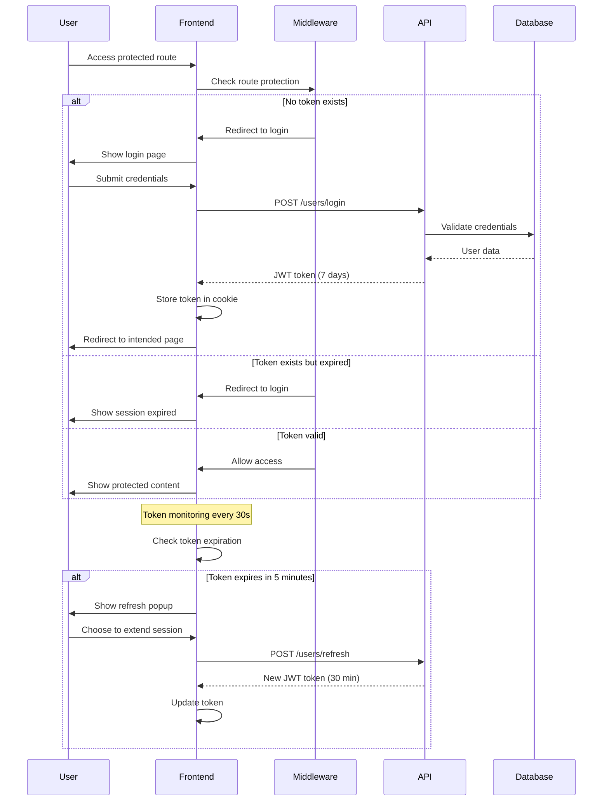
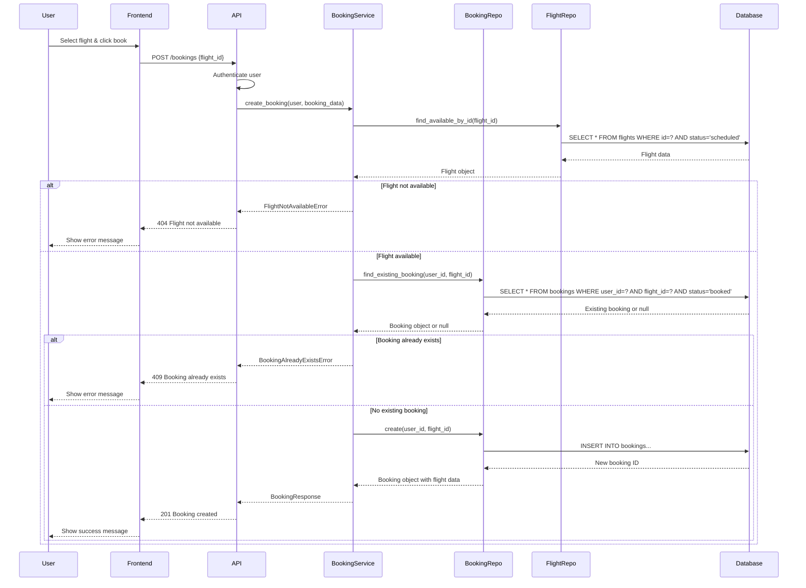

# System Architecture Documentation

This document provides a comprehensive overview of the Flights Chatbot Assistant architecture, including system-wide diagrams and detailed component interactions.

## Overall System Architecture

```mermaid
graph TB
    subgraph "Client Layer"
        Browser[Web Browser]
    end
    
    subgraph "Frontend - Next.js"
        UI[React Components]
        Auth[Authentication Layer]
        Chat[Chat Interface]
        API_Client[API Client]
    end
    
    subgraph "Backend - FastAPI"
        Router[FastAPI Routers]
        Services[Business Services]
        Repos[Repository Layer]
        Models[SQLAlchemy Models]
        DB[(SQLite Database)]
    end
    
    subgraph "AI Services"
        Agent[LangGraph Agent]
        Tools[Flight Tools]
        Memory[Chat Memory]
        OpenAI[OpenAI GPT-4]
    end
    
    Browser --> UI
    UI --> Auth
    UI --> Chat
    UI --> API_Client
    
    API_Client -->|HTTP/REST| Router
    Router --> Services
    Services --> Repos
    Repos --> Models
    Models --> DB
    
    Router -->|Chat Requests| Agent
    Agent --> Tools
    Agent --> Memory
    Agent --> OpenAI
    Tools --> Services
    
    style Frontend fill:#e1f5fe
    style Backend fill:#f3e5f5
    style "AI Services" fill:#e8f5e8
```

## Frontend Architecture

```mermaid
graph TB
    subgraph "Next.js App Router"
        Layout[Root Layout]
        AuthLayout[Auth Layout]
        Pages[Pages]
    end
    
    subgraph "Components"
        AuthComp[Auth Components]
        ChatComp[Chat Components]
        FlightComp[Flight Components]
        LayoutComp[Layout Components]
    end
    
    subgraph "State Management"
        UserContext[User Context]
        TokenManager[Token Manager]
    end
    
    subgraph "API Layer"
        AuthAPI[Auth API]
        FlightAPI[Flight API]
        BookingAPI[Booking API]
        ChatAPI[Chat API]
    end
    
    subgraph "Utilities"
        JWT[JWT Utils]
        Hooks[Custom Hooks]
        Types[TypeScript Types]
    end
    
    Layout --> Pages
    AuthLayout --> Pages
    Pages --> AuthComp
    Pages --> ChatComp
    Pages --> FlightComp
    Pages --> LayoutComp
    
    AuthComp --> UserContext
    AuthComp --> TokenManager
    TokenManager --> JWT
    
    AuthComp --> AuthAPI
    FlightComp --> FlightAPI
    FlightComp --> BookingAPI
    ChatComp --> ChatAPI
    
    AuthAPI --> Hooks
    FlightAPI --> Types
    BookingAPI --> Types
    ChatAPI --> Types
    
    style "Next.js App Router" fill:#e3f2fd
    style "Components" fill:#f1f8e9
    style "State Management" fill:#fff3e0
    style "API Layer" fill:#fce4ec
    style "Utilities" fill:#f3e5f5
```

## API Architecture with Repository Pattern

```mermaid
graph TB
    subgraph "FastAPI Application"
        Main[main.py]
        Routers[Route Handlers]
    end
    
    subgraph "Business Layer"
        UserService[User Service]
        FlightService[Flight Service]
        BookingService[Booking Service]
        ChatService[Chat Service]
        HealthService[Health Service]
    end
    
    subgraph "Repository Layer (Abstraction)"
        UserRepo[User Repository]
        FlightRepo[Flight Repository]
        BookingRepo[Booking Repository]
        ChatRepo[Chat Repository]
    end
    
    subgraph "Data Layer"
        UserModel[User Model]
        FlightModel[Flight Model]
        BookingModel[Booking Model]
        ChatModel[Chat Model]
        SQLite[(SQLite Database)]
    end
    
    subgraph "Cross-Cutting Concerns"
        Auth[JWT Authentication]
        Logging[Logging System]
        Dependencies[DI Container]
        Resources[App Resources]
    end
    
    subgraph "AI Integration"
        ChatManager[Chat Manager]
        LangGraph[LangGraph Agent]
        Tools[Flight Tools]
        Memory[Memory Store]
    end
    
    Main --> Routers
    Routers --> UserService
    Routers --> FlightService
    Routers --> BookingService
    Routers --> ChatService
    Routers --> HealthService
    
    UserService --> UserRepo
    FlightService --> FlightRepo
    BookingService --> BookingRepo
    BookingService --> FlightRepo
    ChatService --> ChatRepo
    
    UserRepo --> UserModel
    FlightRepo --> FlightModel
    BookingRepo --> BookingModel
    ChatRepo --> ChatModel
    
    UserModel --> SQLite
    FlightModel --> SQLite
    BookingModel --> SQLite
    ChatModel --> SQLite
    
    Routers --> Auth
    Routers --> Dependencies
    Dependencies --> Resources
    Resources --> Logging
    
    ChatService --> ChatManager
    ChatManager --> LangGraph
    LangGraph --> Tools
    LangGraph --> Memory
    Tools --> FlightService
    Tools --> BookingService
    
    style "FastAPI Application" fill:#e8f5e8
    style "Business Layer" fill:#e3f2fd
    style "Repository Layer (Abstraction)" fill:#fff3e0
    style "Data Layer" fill:#fce4ec
    style "Cross-Cutting Concerns" fill:#f3e5f5
    style "AI Integration" fill:#f1f8e9
```

## Authentication Flow



## Chat Agent Workflow

```mermaid
graph TB
    subgraph "User Interaction"
        UserInput[User Message]
        ChatUI[Chat Interface]
    end
    
    subgraph "API Processing"
        ChatRouter[Chat Router]
        ChatService[Chat Service]
        Auth[Authentication Check]
    end
    
    subgraph "LangGraph Agent"
        Agent[ReAct Agent]
        Memory[Conversation Memory]
        Planner[Action Planner]
    end
    
    subgraph "Available Tools"
        SearchTool[Search Flights]
        BookTool[Book Flight]
        BookingsTool[Get Bookings]
        CancelTool[Cancel Booking]
        FAQTool[FAQ Search]
    end
    
    subgraph "Backend Services"
        FlightService[Flight Service]
        BookingService[Booking Service]
        FAQStore[FAQ Knowledge Base]
    end
    
    subgraph "Database"
        FlightDB[Flight Data]
        BookingDB[Booking Data]
        ChatHistory[Chat History]
    end
    
    UserInput --> ChatUI
    ChatUI --> ChatRouter
    ChatRouter --> Auth
    Auth --> ChatService
    ChatService --> Agent
    
    Agent --> Memory
    Agent --> Planner
    Planner --> SearchTool
    Planner --> BookTool
    Planner --> BookingsTool
    Planner --> CancelTool
    Planner --> FAQTool
    
    SearchTool --> FlightService
    BookTool --> BookingService
    BookingsTool --> BookingService
    CancelTool --> BookingService
    FAQTool --> FAQStore
    
    FlightService --> FlightDB
    BookingService --> BookingDB
    ChatService --> ChatHistory
    
    Agent -->|Final Response| ChatService
    ChatService -->|Save Conversation| ChatHistory
    ChatService --> ChatRouter
    ChatRouter --> ChatUI
    ChatUI --> UserInput
    
    style "User Interaction" fill:#e1f5fe
    style "API Processing" fill:#e8f5e8
    style "LangGraph Agent" fill:#fff3e0
    style "Available Tools" fill:#f3e5f5
    style "Backend Services" fill:#e3f2fd
    style "Database" fill:#fce4ec
```

## Repository Pattern Implementation

```mermaid
graph TB
    subgraph "Router Layer"
        UserRouter[User Router]
        FlightRouter[Flight Router]
        BookingRouter[Booking Router]
    end
    
    subgraph "Service Layer"
        UserService[User Service]
        FlightService[Flight Service]
        BookingService[Booking Service]
    end
    
    subgraph "Repository Abstractions"
        IUserRepo[UserRepository ABC]
        IFlightRepo[FlightRepository ABC]
        IBookingRepo[BookingRepository ABC]
    end
    
    subgraph "Repository Implementations"
        UserSQLite[UserSqliteRepository]
        FlightSQLite[FlightSqliteRepository]
        BookingSQLite[BookingSqliteRepository]
    end
    
    subgraph "Data Models"
        UserModel[User Model]
        FlightModel[Flight Model]
        BookingModel[Booking Model]
    end
    
    subgraph "Database"
        SQLite[(SQLite Database)]
    end
    
    subgraph "Dependency Injection"
        DI[create_*_repository]
        Session[Database Session]
    end
    
    UserRouter --> UserService
    FlightRouter --> FlightService
    BookingRouter --> BookingService
    
    UserService --> IUserRepo
    FlightService --> IFlightRepo
    BookingService --> IBookingRepo
    BookingService --> IFlightRepo
    
    IUserRepo -.->|implements| UserSQLite
    IFlightRepo -.->|implements| FlightSQLite
    IBookingRepo -.->|implements| BookingSQLite
    
    UserSQLite --> UserModel
    FlightSQLite --> FlightModel
    BookingSQLite --> BookingModel
    
    UserModel --> SQLite
    FlightModel --> SQLite
    BookingModel --> SQLite
    
    DI --> UserSQLite
    DI --> FlightSQLite
    DI --> BookingSQLite
    DI --> Session
    Session --> SQLite
    
    UserService -.->|depends on| DI
    FlightService -.->|depends on| DI
    BookingService -.->|depends on| DI
    
    style "Router Layer" fill:#e8f5e8
    style "Service Layer" fill:#e3f2fd
    style "Repository Abstractions" fill:#fff3e0
    style "Repository Implementations" fill:#f1f8e9
    style "Data Models" fill:#fce4ec
    style "Database" fill:#f3e5f5
    style "Dependency Injection" fill:#e1f5fe
```

## Request Flow Example: Booking a Flight



## Key Architecture Benefits

### 1. Separation of Concerns
- **Frontend**: UI/UX, state management, API communication
- **Backend Services**: Business logic, validation, orchestration
- **Repositories**: Data access abstraction
- **Models**: Data structure and relationships

### 2. Repository Pattern Advantages
- **Testability**: Easy to mock for unit tests
- **Flexibility**: Can switch database implementations
- **Consistency**: Standardized data access patterns
- **Maintainability**: Centralized database logic

### 3. AI Integration
- **Modular Tools**: Each tool handles specific operations
- **Memory Management**: Persistent conversation context
- **Authentication**: Secure access to user-specific data
- **Error Handling**: Graceful degradation when services fail

### 4. Scalability Considerations
- **Stateless Services**: Easy horizontal scaling
- **Database Abstraction**: Can migrate to different databases
- **Microservice Ready**: Services can be extracted to separate applications
- **Caching Layer**: Repository pattern supports caching implementation